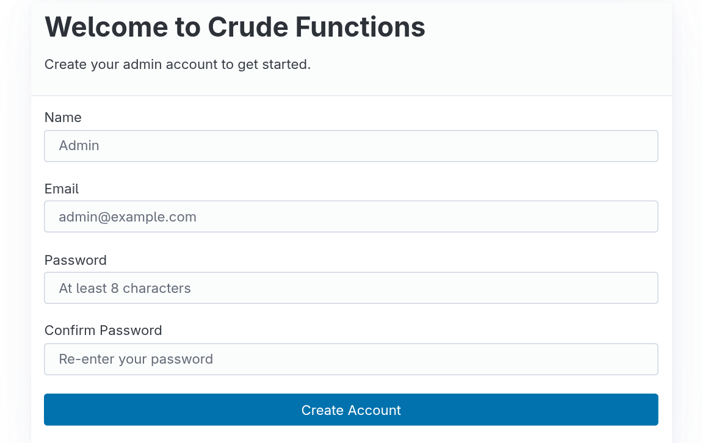
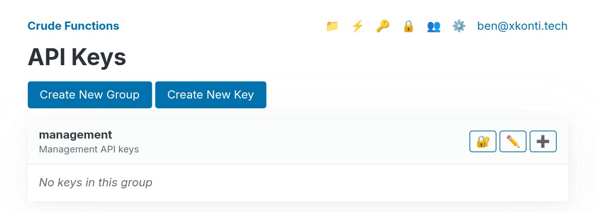
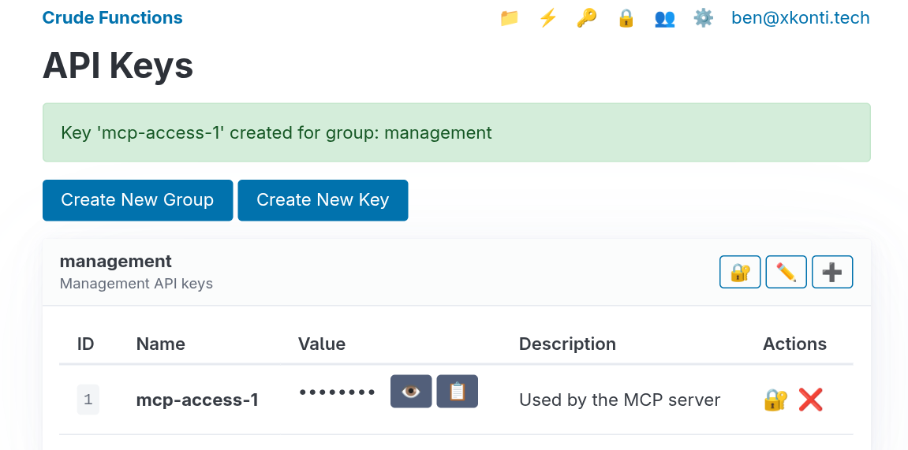

After deploying Crude Functions for the first time, you'll need to create an admin user and configure initial settings. This guide walks through the essential first-time setup steps.

## What Happens on First Run

On first startup, Crude Functions automatically:

1. Creates SQLite database at `./data/database.db`
2. Generates encryption keys at `./data/encryption-keys.json`
3. Runs database migrations
4. Enables the sign-up page for admin user creation

The server is now ready for you to create your admin account.

## Creating Your Admin User

### Access the Web UI

Navigate to the web interface:

```
http://localhost:9000/web
```

If deploying remotely, replace `localhost:9000` with your server's address.



### Complete the Sign-Up Form

1. Enter your email address
2. Create a strong password (minimum 8 characters)
3. Click "Create Account"

**Important:** After this first user is created, you cannot use the sign-up page again. Additional users must be added through the *Users* page in the web UI.

## Management API keys

Initially, access to API endpoints for managing the Crude Functions server is restricted to the logged in users. To allow programmatic access you need to create an API key within the defined API Access Group. By default Crude Functions comes with a `management` API key group which is already set in the settings to allow access to the management API. All you need to do is create the actual API key within that group.

### Creating new management key

Click the 🔑 icon in the navigation bar or go to `http://localhost:9000/web/keys`.



Then using the ➕ button you can create a new key within the `management` group.

The web UI will show partial keys (last 6 characters) after creation for security.



### Test Your API Key

Verify the key works:

```bash
curl -H "X-API-Key: your-key-value-here" \
  http://localhost:9000/api/key-groups
```

You should receive a JSON response listing API key groups (at minimum the `management` group you just created a key for):

```json
{
  "groups": [
    {
      "id": 1,
      "name": "management",
      "description": "Management API keys"
    }
  ]
}
```

## Understanding the Data Directory

Everything persistent lives in `./data/`:

```
data/
├── database.db           # Routes, functions, API keys, users, secrets, logs, metrics
└── encryption-keys.json  # AES-256-GCM keys for encrypting API keys and secrets
```

### Critical: Back Up Your Encryption Keys

**If you lose `encryption-keys.json`, you lose access to all encrypted data permanently.** Store the backup in a secure location separate from your server.
