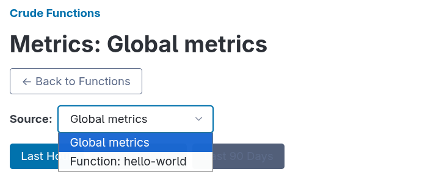

Crude Functions automatically collects execution metrics for all function invocations, providing insights into performance, request volumes, and execution patterns. This guide explains what metrics are collected, how they're aggregated, and how to access them.

## What Metrics Are Collected

Every function execution automatically records:

- **Execution Count** - Total number of function invocations
- **Average Execution Time** - Weighted average execution time in milliseconds
- **Maximum Execution Time** - Peak execution time in milliseconds
- **Timestamp** - When the metrics were recorded (UTC)

These metrics are collected for:

- **Per-function metrics** - Track individual function performance
- **Global metrics** - Aggregate performance across all functions

**No configuration required** - metrics collection starts automatically when you deploy functions.

## Time Resolutions

Metrics are aggregated at three time resolutions to balance detail with storage efficiency:

### Minutes

- **Granularity**: 1 data point per minute
- **Viewing window**: Last 60 minutes
- **Use case**: Real-time monitoring, immediate performance issues

### Hours

- **Granularity**: 1 data point per hour
- **Viewing window**: Last 24 hours
- **Use case**: Daily trends, hourly traffic patterns

### Days

- **Granularity**: 1 data point per day
- **Viewing window**: Configurable retention period (default: 90 days)
- **Use case**: Long-term trends, capacity planning

### Background Processing

The aggregation service runs automatically:

- **Default interval**: Every 60 seconds
- **Catches up automatically**: Processes missed periods after restarts
- **Watermark tracking**: Remembers progress to prevent reprocessing
- **Graceful degradation**: Failures don't stop function execution
- **Destructive**: Deletes processed raw data to keep the database footprint minimal

**Configuration**: Aggregation interval and retention period are set in Settings.

## Viewing Metrics in the Web UI

### Per-Function Metrics

Functions management page → Click 📊 next to any function

The metrics page shows:

**Summary Cards** (top of page):

- **Avg Executions / {period}** - Average requests per time unit
- **Avg Execution Time** - Overall weighted average in milliseconds
- **Max Execution Time** - Peak execution time across all periods
- **Total Executions** - Sum of all executions in the time range

**Execution Time Chart** (line graph):

- Blue line: Average execution time per period
- Red line: Maximum execution time per period
- Orange markers: Current incomplete period (live data)
- Gray dashed lines: Periods with no activity (interpolated)

**Request Count Chart** (bar graph):

- Blue bars: Number of executions per period
- Orange bars: Current incomplete period (live data)
- Hover to see exact counts

**Time Range Tabs**:

- Last Hour (minute-by-minute)
- Last 24 Hours (hour-by-hour)
- Last X Days (day-by-day, based on retention setting)

### Global Metrics

Global metrics can be accessed from within any functions metrics page by selecting `Global metrics` in the `Source` dropdown:

The Global metrics show aggregated metrics across **all functions** on your server:

- Same chart types as per-function view
- Combines data from all routes
- Useful for understanding overall server load

## Understanding Performance Data

### Reading Execution Times

**Average Execution Time**:

- Weighted average across all executions in the period
- Lower is better (faster responses)
- Sudden increases may indicate:
  - Database slowdowns
  - External API latency
  - Increased payload sizes
  - Code performance issues

**Maximum Execution Time**:

- Longest single execution in the period
- Spikes are normal for:
  - First execution
  - Database connection establishment
  - Cache misses
  - When Deno needs to download imported third party packages for the first time
- Consistently high maximums may indicate:
  - Timeout-prone operations
  - Unhandled edge cases
  - Resource contention

### Reading Execution Counts

**Request Volume**:

- Shows traffic patterns and usage trends
- Compare to expected patterns:
  - Business hours vs. off-hours
  - Weekday vs. weekend
  - Seasonal variations

**Drops in volume** may indicate:

- Service interruptions
- Client-side issues
- API key problems
- Function disabled

**Spikes in volume** may indicate:

- Marketing campaigns
- Viral content
- Automated traffic (bots, scrapers)
- Retry storms

## Metrics Retention and Storage

### Retention Policy

**Default**: 90 days of daily metrics - Configurable in Settings

### What Gets Deleted

The aggregation service automatically cleans up:

1. **Processed raw executions** - Deleted after aggregation to minutes
2. **Processed minute records** - Deleted after aggregation to hours
3. **Processed hour records** - Deleted after aggregation to days
4. **Old daily records** - Deleted after retention period expires

**Result**: Efficient storage with minimal overhead while preserving long-term trends.

### Storage Estimates

Unlike traditional time-series databases, Crude Functions uses aggressive aggregation and cleanup to maintain a **constant storage footprint per function**, regardless of retention period. Storage is determined by traffic rate, not retention days.

#### Per-Function Storage (90-day retention)

| Traffic Rate | Raw Records (2 min) | Total Records | Estimated Storage |
|--------------|---------------------|---------------|-------------------|
| 1 req/min    | 2                   | 176           | ~52 KB            |
| 10 req/min   | 20                  | 194           | ~58 KB            |
| 100 req/min  | 200                 | 374           | ~112 KB           |
| 1000 req/min | 2000                | 2174          | ~652 KB           |

**Total records** = Raw records + 174 aggregated records (60 minute + 24 hour + 90 day)

**Storage calculation**: ~300 bytes per record (data + index overhead)

#### Example Deployments

- **10 low-traffic functions** (10 req/min each): ~580 KB total
- **10 mixed-traffic functions** (1-100 req/min): ~580 KB - 1 MB total
- **10 high-traffic functions** (1000 req/min each): ~6.5 MB total

**Key insight**: Increasing retention days from 90 to 365 only adds ~82 KB per function (275 additional day records), making long-term retention very affordable.
