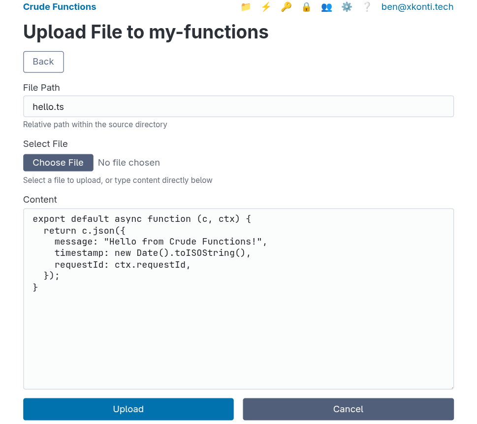
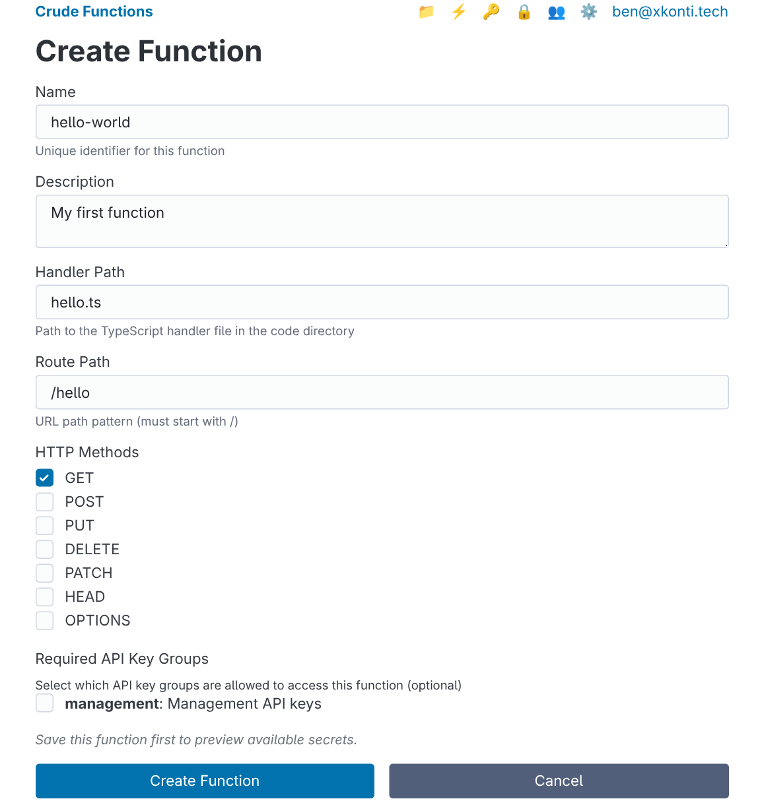
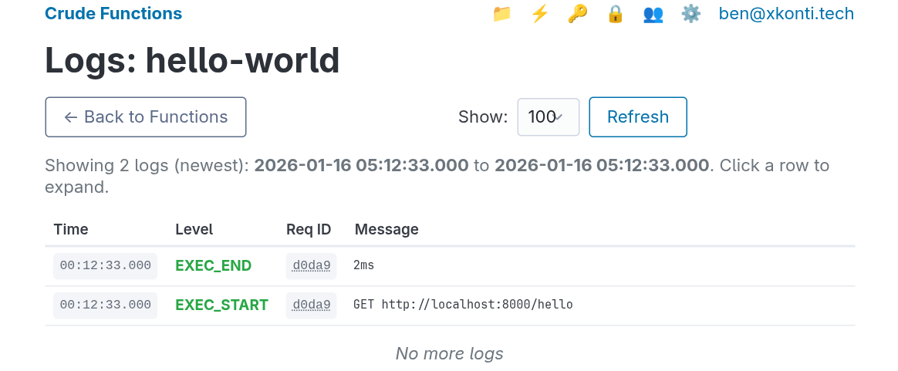
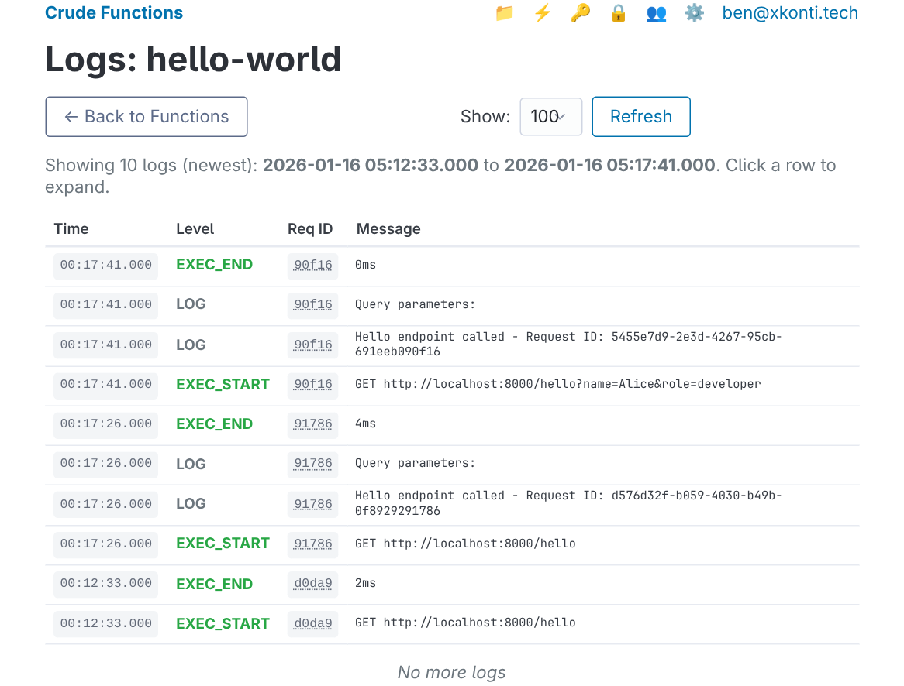
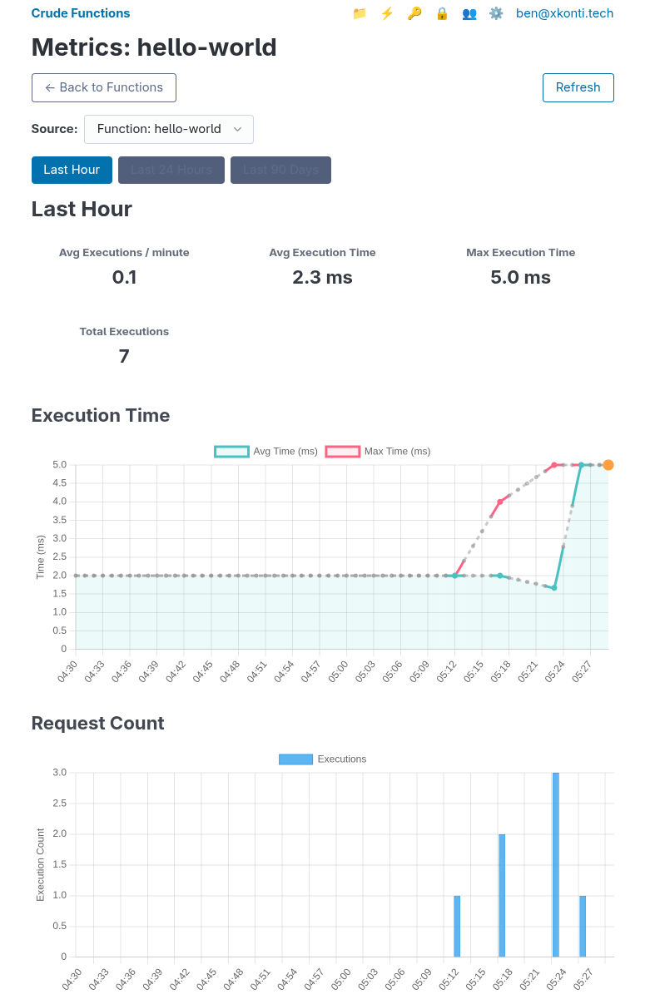

This tutorial walks you through creating, deploying, and testing your first function in Crude Functions. You'll learn the complete workflow from writing code to calling your endpoint.

## What We'll Build

A simple "Hello World" function that:

- Responds with JSON
- Shows the current timestamp
- Includes request metadata
- Demonstrates hot-reload capability

## Prerequisites

Before starting, make sure you have:

- Crude Functions running at `http://localhost:8000`
- Completed the initial setup (created your admin account)
- Access to the web UI or API

If you haven't installed Crude Functions yet, see the [Getting Started](/guides/getting-started) guide.

## Understanding Code Sources

Before we create our first function, let's understand how Crude Functions organizes your code.

Code is organized into **code sources**. Each code source is represented by a directory. Think of them as separate folders for different projects or deployment environments. Currently there are two types of code sources:

- **Manual code sources** - Upload and edit files directly via the web UI
- **Git code sources** - Automatically sync files from a Git repository

In this guide, we'll focus on the **manual code source** to keep things simple.

### Creating a Code Source

When you first access the Code Management Page 📁, you will need to create your first code source:

1. Navigate to the Code Management Page 📁 or go to `http://localhost:8000/web/code`
2. Click "New Code Source" button
3. Choose the "Create Manual Source"
3. Enter a name of the new source - this will be the name of the created directory (e.g., `my-functions`)
5. Click "Create Source"

For the rest of this tutorial, we'll assume you have a source named `my-functions`. If your source has a different name, just substitute it wherever you see `my-functions` in the examples.

## Step 1: Create the Handler File

Every function in Crude Functions is a TypeScript or JavaScript file with a default function export in the appropriate format. Let's create our first handler.

1. Go to the 📁 code management page at `http://localhost:8000/web/code`
2. Click on your code source (e.g., `my-functions`) to open it
3. Click the `Upload New File` button
4. Create a file called `hello.ts` with the following code:

```typescript
export default async function (c, ctx) {
  return c.json({
    message: "Hello from Crude Functions!",
    timestamp: new Date().toISOString(),
    requestId: ctx.requestId,
  });
}
```



### Understanding the Handler Structure

Every function handler receives exactly two parameters:

| Parameter | Type | Purpose |
|-----------|------|---------|
| `c` | [Hono Context](https://hono.dev/docs/api/context) | Request/response handling (like Express `req`/`res`) |
| `ctx` | Function Context | Route metadata, params, query, secrets, request ID |

**The `c` parameter** lets you:

- Read request data (`c.req.json()`, `c.req.header()`, etc.)
- Send responses (`c.json()`, `c.text()`, `c.html()`, `c.redirect()`)

**The `ctx` parameter** provides:

- `ctx.params` - Path parameters (e.g., `/users/:id`)
- `ctx.query` - Query string parameters
- `ctx.requestId` - Unique request identifier
- `ctx.authenticatedKeyGroup` - API key group (if authenticated)
- `ctx.getSecret()` - Access to secrets
- `ctx.route` - Route configuration details

See the [Handler Context Reference](/reference/handler-context) for the complete API.

## Step 2: Register the Route

Now that we have our handler file, we need to register it as a function route.

1. Navigate to `http://localhost:8000/web/functions` (the ⚡ tab)
2. Click the "Create New Function" button
3. Fill in the form:

| Field | Value | Description |
|-------|-------|-------------|
| **Name** | `hello-world` | Unique identifier for the function |
| **Description** | `My first function` | Human-readable description (optional) |
| **Handler** | `my-functions/hello.ts` | Path to handler file in format `sourceName/fileName.ts` |
| **Route** | `/hello` | URL path where function will be accessible |
| **Methods** | `GET` | HTTP methods allowed |
| **API Keys** | *(leave empty)* | No authentication required for now |

4. Click "Create"



You should see your new function in the functions list with a green "Enabled" status.


**Note**: The handler path must include the source name. If your source has a different name, use `yourSourceName/hello.ts` instead.

## Step 3: Test Your Function

Your function is now live. Let's test it.

```bash
curl http://localhost:8000/run/hello
```

You should see a JSON response like:

```json
{
  "message": "Hello from Crude Functions!",
  "timestamp": "2026-01-16T05:07:24.475Z",
  "requestId": "dc791018-0edf-4b15-a8e0-e6d81bd78ff6"
}
```

## Step 4: View Logs

Crude Functions automatically captures all console output from your functions.

1. Go to `http://localhost:8000/web/functions`
2. Click the 📝 button on the function entry

The only thing you'll see are the `EXET_START` and `EXEC_END` events because our function doesn't write anything to the output. Let's add some logging.



## Step 5: Add Logging and Hot-Reload

Since we're using a manual source, we can directly edit files via the web UI. Go to your code source, find `hello.ts`, and edit it to add some console output:

```typescript
export default async function (c, ctx) {
  console.log(`Hello endpoint called - Request ID: ${ctx.requestId}`);
  console.log(`Query parameters:`, ctx.query);

  return c.json({
    message: "Hello from Crude Functions!",
    timestamp: new Date().toISOString(),
    requestId: ctx.requestId,
    query: ctx.query,
  });
}
```

**Save the file.** That's it - no restart needed.

### Test the hot-reload

```bash
# Call it without query parameters
curl http://localhost:8000/run/hello

# Call it with query parameters
curl "http://localhost:8000/run/hello?name=Alice&role=developer"
```

Response with query parameters:

```json
{
  "message": "Hello from Crude Functions!",
  "timestamp": "2026-01-16T05:17:41.122Z",
  "requestId": "5455e7d9-2e3d-4267-95cb-691eeb090f16",
  "query": {
    "name": "Alice",
    "role": "developer"
  }
}
```

### Check the logs

Go back to the web UI and refresh the Logs tab. You should now see entries like:



## Step 6: Handle Path Parameters

Let's make our function more dynamic by accepting a path parameter.

### Update the route

1. Go to `http://localhost:8000/web/functions`
2. Click ✏️ on your `hello-world` function
3. Change the **Route Path** to `/hello/:name`
4. Click "Save"

### Update the handler

Edit `hello.ts` to use the path parameter:

```typescript
export default async function (c, ctx) {
  const name = ctx.params.name || "Guest";

  console.log(`Greeting ${name} - Request ID: ${ctx.requestId}`);

  return c.json({
    message: `Hello, ${name}!`,
    timestamp: new Date().toISOString(),
    requestId: ctx.requestId,
  });
}
```

### Test with different names

```bash
curl http://localhost:8000/run/hello/Alice
# Response: {"message": "Hello, Alice!", ...}

curl http://localhost:8000/run/hello/Bob
# Response: {"message": "Hello, Bob!", ...}

curl http://localhost:8000/run/hello/Claude
# Response: {"message": "Hello, Claude!", ...}
```

## Step 7: Handle POST Requests

Functions can handle multiple HTTP methods. Let's add POST support.

### Update the route

1. Edit your function in the web UI
2. Change **HTTP Methods** to include both `GET` and `POST`
3. Save

### Update the handler to handle both methods differently

```typescript
export default async function (c, ctx) {
  const method = c.req.method;

  // Handle GET request
  if (method === "GET") {
    const name = ctx.params.name || "Guest";
    console.log(`GET request - Greeting ${name}`);

    return c.json({
      message: `Hello, ${name}!`,
      timestamp: new Date().toISOString(),
    });
  }

  // Handle POST request
  if (method === "POST") {
    const body = await c.req.json();
    console.log(`POST request - Received:`, body);

    return c.json({
      message: `Hello, ${body.name || "Guest"}!`,
      received: body,
      timestamp: new Date().toISOString(),
    }, 201);
  }

  // Return error, even though Crude Functions won't let those requests
  // into the handler if methods are not allowed in function definition.
  return c.json({ error: "Method not allowed" }, 405);
}
```

### Test POST requests

```bash
# POST with JSON body
curl -X POST http://localhost:8000/run/hello/someone \
  -H "Content-Type: application/json" \
  -d '{"name": "Alice", "role": "developer"}'
```

Response:

```json
{
  "message": "Hello, Alice!",
  "received": {
    "name": "Alice",
    "role": "developer"
  },
  "timestamp": "2026-01-16T05:26:53.224Z"
}
```

## Step 8: View Execution Metrics

Crude Functions tracks execution metrics for every function call.

1. Go to the functions management page in the Web UI
2. Click on the 📊 button your hello-world function to view it's metrics

You'll see charts showing:

- **Execution time** - Average and maximum response times
- **Request count** - Number of executions over time

The metrics are aggregated by minute, hour, and day depending on the time range you select.



## Next Steps

Congratulations! You've created, deployed, and tested your first function. Here's what to explore next:

### Add Authentication

Protect your function with API keys:

1. Go to the API key management page
2. Create a new key group (e.g., `api`)
3. Add an API key to the group
4. Edit your function select the new group in the **Required API Key Groups** section
5. Test with authentication:

```bash
# Without key - will fail
curl http://localhost:8000/run/hello/Alice

# With key - will work
curl -H "X-API-Key: your-key-value" http://localhost:8000/run/hello/Alice
```

### Use External Packages

Add external dependencies to your function:

```typescript
import { format } from "npm:date-fns";
import { camelCase } from "npm:lodash-es";

export default async function (c, ctx) {
  const name = ctx.params.name || "Guest";
  const formatted = camelCase(name);
  const timestamp = format(new Date(), "PPpp");

  return c.json({
    message: `Hello, ${formatted}!`,
    timestamp,
  });
}
```

Deno will automatically download and cache the packages on first import.

```json
{
  "message": "Hello, someone!",
  "timestamp": "Jan 16, 2026, 12:33:30 AM"
}
```

### Work with Secrets

Store sensitive data like API keys securely:

1. Go to `http://localhost:8000/web/secrets`
2. Add a global secret:
   - **Name**: `GREETING_PREFIX`
   - **Value**: `Welcome to Crude Functions`
3. Update your handler:

```typescript
export default async function (c, ctx) {
  const prefix = await ctx.getSecret("GREETING_PREFIX") || "Hello";
  const name = ctx.params.name || "Guest";

  return c.json({
    message: `${prefix}, ${name}!`,
    timestamp: new Date().toISOString(),
  });
}
```

Result:

```json
{
  "message": "Welcome to Crude Functions, someone!",
  "timestamp": "2026-01-16T05:36:15.041Z"
}
```

### Create Shared Utilities

Organize your code with shared modules. Within your code source (e.g., `my-functions`), create a file `lib/formatters.ts` - this will create a subdirectory called `lib` with `formatters.ts` inside.

```typescript
export function formatGreeting(name: string): string {
  return `Hello, ${name.trim()}!`;
}

export function getTimestamp(): string {
  return new Date().toISOString();
}
```

Then update `hello.ts` to use it with a relative import:

```ts
import { formatGreeting, getTimestamp } from "./lib/formatters.ts";

export default async function (c, ctx) {
  const name = ctx.params.name || "Guest";

  return c.json({
    message: formatGreeting(name),
    timestamp: getTimestamp(),
  });
}
```

The files would be organized in your source like this:

```
my-functions/
├── hello.ts
└── lib/
    └── formatters.ts
```

You can also reference code from other code sources. If you were to create a separate code source named `lib` and place the `formatters.ts` inside, from `hello.ts` you could reach it via `../lib/formatters.ts`.
